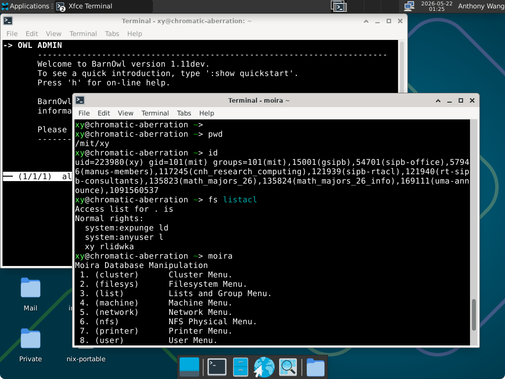

# Nixathena

Turn any computer into an Athena workstation running a modern OS (not Ubuntu 14.04)!

This is a fork of adenhert's Nixathena project to add support for Athena workstations, which is used by the [SIPB Chromebox](https://forgejo.mit.edu/SIPB/chromebox). Just add this flake to your NixOS config and now you have an Athena workstation! It may take up to two minutes to log in (TODO debug this). Some of the features require your machine to be on MIT Ethernet.

Packaged so far: `attach`/`add` (Python implementation, not the original C), debathena-lightdm-greeter, moira, remctl, zephyr, BarnOwl (was a huge PITA to package), athrun

## Screenshots





## Installation

To run apps from this repo without installing anything, for instance Moira, just run `nix run git+https://forgejo.mit.edu/SIPB/nixathena.git#moira`.

Nixathena officially only supports flakes. First, add this as a flake input:

```nix
nixathena = {
  url = "git+https://forgejo.mit.edu/SIPB/nixathena.git";
  inputs.nixpkgs.follows = "nixpkgs";
};
```

Then, add it as a module:

```nix
modules = [
  [...]
  inputs.nixathena.nixosModules.default
  # Uncomment the following line to get a workstation where anyone can log in
  # { nixathena.workstation = true; }
];
```

