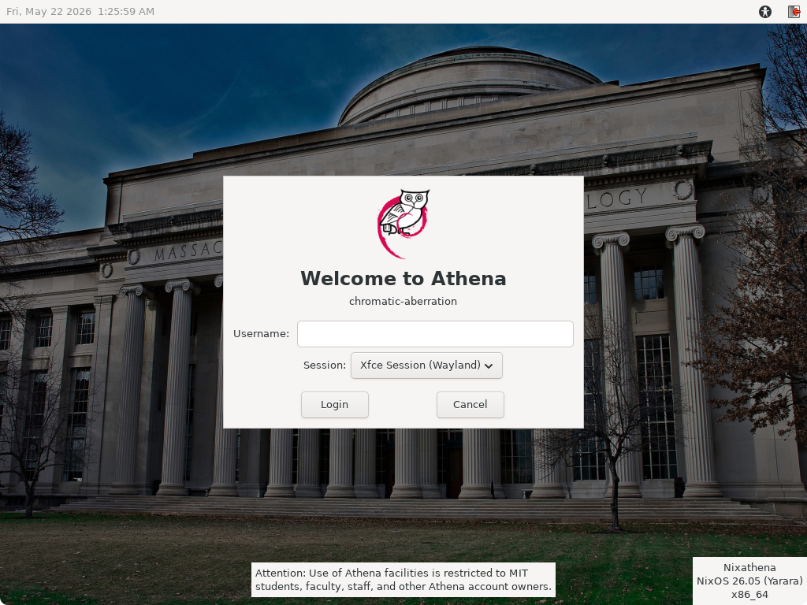

# Nixathena

Turn any computer into an Athena workstation running a modern OS (not Ubuntu 14.04)!

This is a fork of adenhert's Nixathena project to add support for Athena workstations, which is used by the [SIPB Chromebox](https://forgejo.mit.edu/SIPB/chromebox). Just add this flake to your NixOS config and now you have an Athena workstation! It may take up to two minutes to log in. Some of the features require your machine to be on MIT Ethernet.

Packaged so far: `attach`/`add` (Python implementation, not the original C), debathena-lightdm-greeter, moira, remctl, zephyr, BarnOwl (was a huge PITA to package), athrun

See https://www.mit.edu/~xy/nixathena/ for config docs.

## Screenshots




## Usage

Nixathena requires flakes to be enabled.

To run apps from this repo without installing anything, for instance Moira, just run `nix run git+https://forgejo.mit.edu/SIPB/nixathena.git#moira`.

To install all the Nixathena software, first add this repo as a flake input:

```nix
nixathena = {
  url = "git+https://forgejo.mit.edu/SIPB/nixathena.git";
  inputs.nixpkgs.follows = "nixpkgs";
};
```

Then, add the default module:

```nix
modules = [
  [...]
  inputs.nixathena.nixosModules.default
  # Uncomment the following line to get a workstation where anyone can log in
  # { nixathena.workstation = true; }
];
```

## Development

Run tests: `nix run .#test.meta`

Build docs (must have a clean working tree): `nix build .#docs-rendered`

## TODO

- CI?
- Binary cache?
- Upstream our Python 3 patches?
