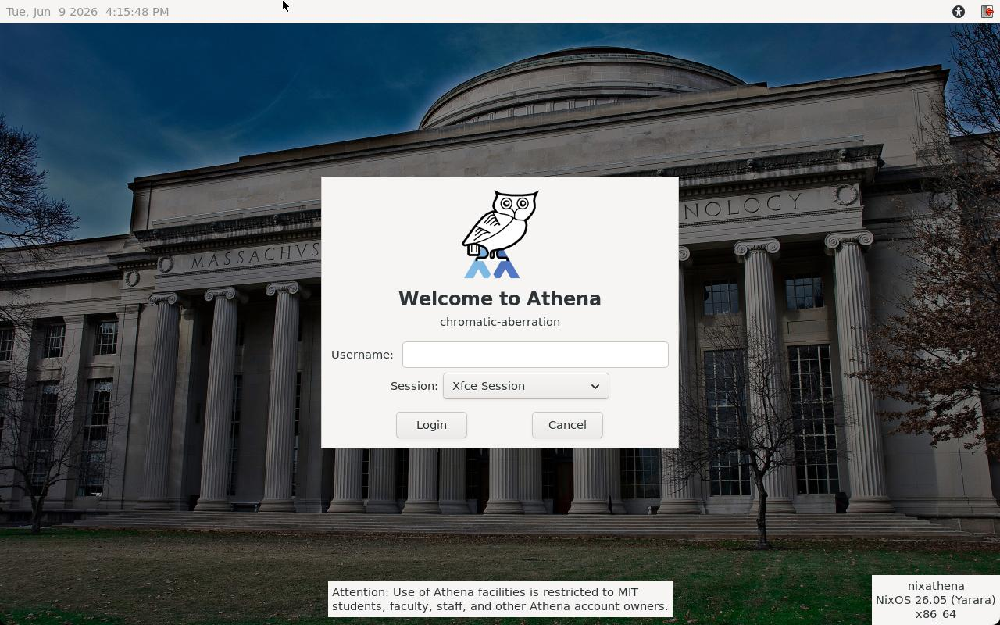
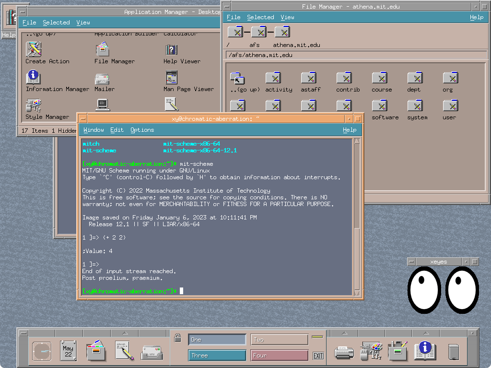

# Nixathena

Turn any computer into an Athena workstation running a modern OS (not Ubuntu 14.04)!

This is a fork of [adenhert's Nixathena repo](https://github.com/dehnert/nixathena) to add support for Athena workstations, such as the [ones in the SIPB office](https://forgejo.mit.edu/SIPB/workstations). Just add this flake to your NixOS config and now you have an Athena workstation! Some of the features require your machine to be on MIT Ethernet.

Special thanks to adehnert, andersk, and all other Debathena contributors for making this project possible!

## Features

- Run programs from lockers using `athrun`/`attach`/`add` (Python implementation, not the original C)
- The original [Debathena login screen](https://forgejo.mit.edu/SIPB/lightdm-config), now running on Wayland using labwc!
- Moira
- remctl and remctld
- Zephyr and BarnOwl
- [SSH in using your Kerberos password or Kerberos tickets](docs/kerberized-server.md)
- Use AFS as your home directory via `pam-afs-session`
- x86_64, aarch64, and i686 are all supported

See https://www.mit.edu/~xy/nixathena/ for config docs.

## Screenshots






## Usage

Nixathena requires flakes to be enabled.

To run apps from this repo without installing anything, for instance Moira, just run `nix run git+https://forgejo.mit.edu/SIPB/nixathena.git#moira`.

To install all the Nixathena software, first add this repo as a flake input:

```nix
nixathena = {
  url = "git+https://forgejo.mit.edu/SIPB/nixathena.git";
  inputs.nixpkgs.follows = "nixpkgs";
};
```

Then, add the default module:

```nix
modules = [
  [...]
  inputs.nixathena.nixosModules.default
];
```

Finally, enable Nixathena in your NixOS config:

```nix
nixathena.enable = true;
# Uncomment this line to get a workstation where anyone can log in
# nixathena.workstation = true;
```

## Development

Run tests: `nix run .#test.meta`

TODO: How to run aarch64 tests on x86_64? (`nix run .#packages.aarch64-linux.test.meta` will run the qemu-system-aarch64 using qemu-user-static-aarch64 which is really slow)

Build docs (must have a clean working tree): `nix build .#docs-rendered`

See the [workstations repo](https://forgejo.mit.edu/SIPB/workstations#building-a-vm) for how to build a VM.

## TODO

- CI (run tests, generate and publish docs)
- Binary cache?
- Package more Athena software? (i.e. machtype?)
- More tests
- Figure out why `attach` with no args throws an error
